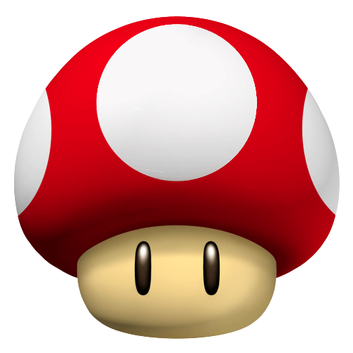
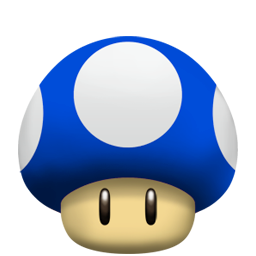
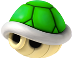
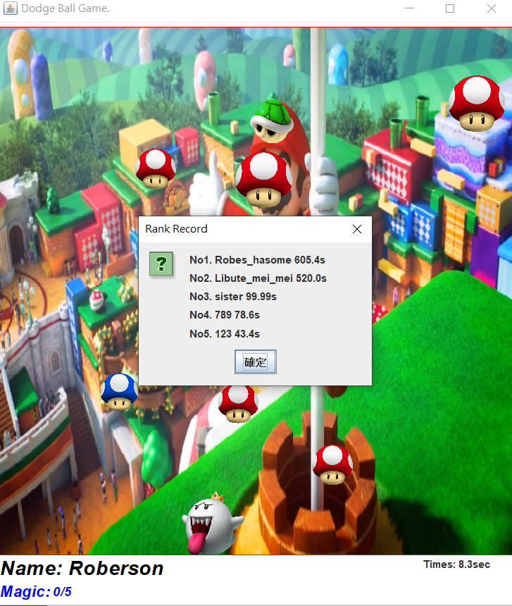
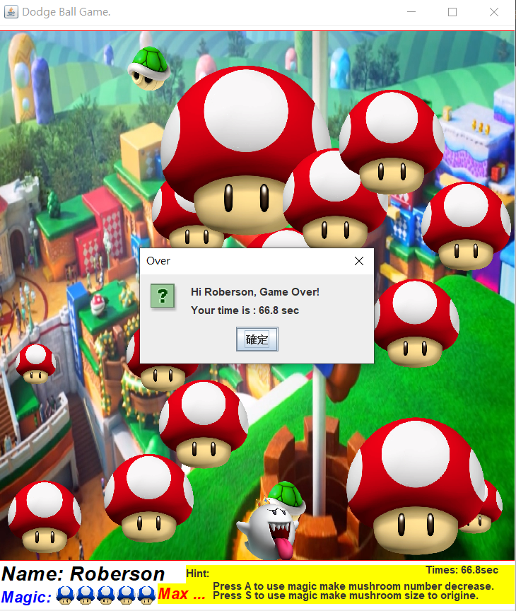
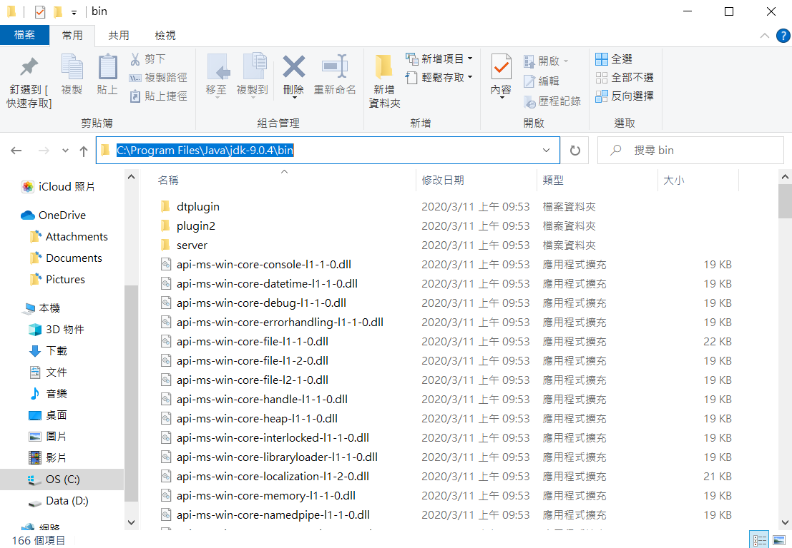
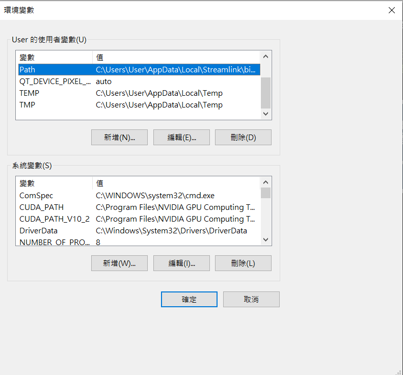
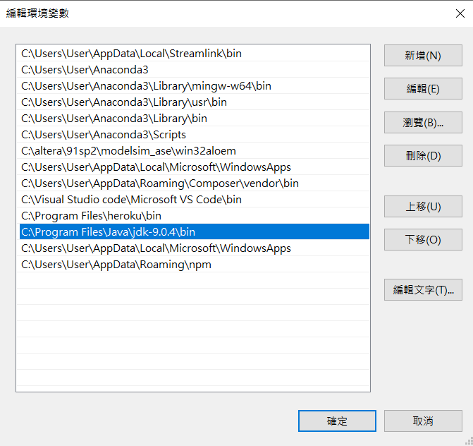

# MushroomGame
## Introduction
本次專案是利用Java開發一個Mushroom小遊戲，使用左右方向鍵進行移動。

遊戲中會有許多掉落物，並且掉落速度會隨著遊戲時間進行而增快，掉落物分為以下幾項:
1. Red Mushroom
2. Blue Mushroom
3. 烏龜殼

## Getting Started
### 掉落物
- Red Mushroom: 如下圖左方，為一般障礙物，會隨著時間進行而變大。

- Blue Mushroom: 如下圖中間，收集滿5個Blue Mushroom即可使用技能。

- 烏龜殼: 如下圖右方，當接觸到烏龜殼，遊戲立即結束。

<div style="float:left;border:solid 1px 000;margin:2px;">



</div>


### 技能
收集滿5個藍色香菇即可使用技能，當收集完成時
- 按下A按鍵，即可觸發減少Red Mushroom的數量。
<div align="center">

</div>

- 按下S按鍵，即可讓隨著遊戲進行而變大的Red Mushroom返回原本的大小。

<div align="center">

</div>

### 快捷鍵
- 如下圖，按下R按鍵，即可查看目前挑戰著挑戰時間最長紀錄，並且遊戲將會暫停。

<div align="center">

</div>

### 遊戲結束
- 當碰到烏龜殼時，遊戲立即結束，並且會記錄ID及挑戰持續時間到資料庫。

<div align="center">

</div>

## Usage
### 環境建置
1. 找到Java jdk的位置，並複製其位置路徑。

<div align="center">

</div>

2. 本機 -> 右鍵點選內容 -> 進階系統設定 -> 環境變數

<div align="center">

</div>

3. 點選上方方格內的Path -> 編輯 ->新增Step1複製的路徑 
(ex:Program Files\Java\jdk-9.0.4\bin)

<div align="center">

</div>

4. 按確定後 -> 重開CMD

### 輸入執行指令:
  ``` bash
  # Compile Program
  $ javac Project_pro.java

  # Execute Game
  $ java Project_pro
  ```